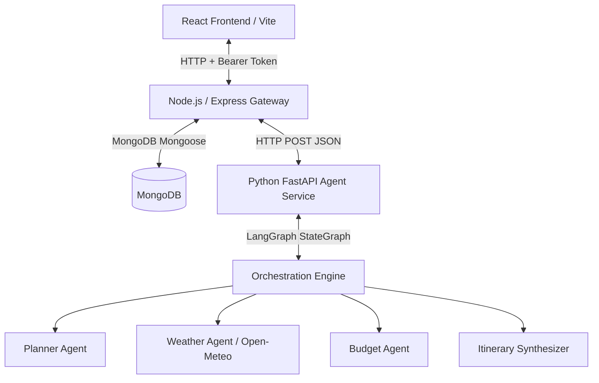

# AI Travel Planner (Voyager AI)

A full-stack, modular travel itinerary generator utilizing an orchestrator pattern with multiple specialized AI agents powered by **LangGraph**, **LangChain**, **FastAPI**, **Express**, **React with Vite**, and **MongoDB**.

---

## Technical Architecture

The application is structured into three self-contained services:



1. **Frontend (React + Vite)**: A premium glassmorphic UI displaying dynamic loaders, custom styled questionnaire inputs, saved grids, detail layouts, and an interactive inline editing console.
2. **Backend Gateway (Node.js + Express)**: Handles user registration and JWT authentication, validates inputs, interfaces with MongoDB, and forwards context requests to the AI agent service.
3. **AI Agent Service (Python + FastAPI)**: An asynchronous API execution tier implementing a StateGraph workflow across four distinct agents:
   - **Planner Agent**: Synthesizes travel profiles and determines logistics or modification deltas.
   - **Weather Agent**: Geocodes the destination and fetches forecast parameters from the free **Open-Meteo API** to build custom packing/schedule warnings.
   - **Budget Agent**: Analyzes budget boundaries and divides costs per category/day.
   - **Itinerary Synthesizer**: Composes the final itinerary matching a strict JSON schema layout.

---

## Folder Structure

```
ai-travel-planner/
  frontend/
    src/
      components/
        Navbar.jsx
      pages/
        Home.jsx
        SavedTrips.jsx
        TripDetails.jsx
        Login.jsx
        Register.jsx
      services/
        tripService.js
      App.jsx
      main.jsx
      index.css
    index.html
    package.json
    vite.config.js
  backend/
    src/
      controllers/
        authController.js
        tripController.js
      middleware/
        authMiddleware.js
      models/
        User.js
        Trip.js
      routes/
        authRoutes.js
        tripRoutes.js
      services/
        agentService.js
      app.js
      server.js
    .env.example
    package.json
  agent-service/
    agents/
      budget_agent.py
      itinerary_agent.py
      model.py
      planner_agent.py
      types.py
      weather_agent.py
      workflow.py
    app.py
    schemas.py
    requirements.txt
    .env.example
  README.md
```

---

## Quick Start Installation

Ensure you have **Node.js** (v18+) and **Python** (v3.9+) installed, along with a running instance of **MongoDB** locally (or an Atlas connection string).

### 1. Set Up Python Agent Service
Open a terminal in the `agent-service` directory:
```bash
cd agent-service
# Set up virtual environment
python -m venv venv
venv\Scripts\activate      # Windows
source venv/bin/activate   # macOS/Linux

# Install dependencies
pip install -r requirements.txt

# Configure Environment
copy .env.example .env
```
Edit `.env` and add your `OPENAI_API_KEY`.

### 2. Set Up Node.js Backend Gateway
Open a second terminal in the `backend` directory:
```bash
cd backend
npm install

# Configure Environment
copy .env.example .env
```
Ensure `.env` matches your MongoDB connection configuration.

### 3. Set Up React Frontend Web App
Open a third terminal in the `frontend` directory:
```bash
cd frontend
npm install
```

---

## Running the Application

### Start Python Agent Service
```bash
cd agent-service
# Ensure virtual environment is active
python app.py
```
*API runs at `http://localhost:8000` (docs available at `/docs`).*

### Start Express Backend Gateway
```bash
cd backend
npm run dev
```
*Backend runs at `http://localhost:5000`.*

### Start React Frontend
```bash
cd frontend
npm run dev
```
*App will start locally at `http://localhost:3000`.*

---

## Sample Request Flows

### 1. AI Generation Request Payload (`POST /api/trip/generate`)
**Headers**: `Authorization: Bearer <JWT_TOKEN>`
```json
{
  "destination": "Rome",
  "days": 3,
  "budget": 2000,
  "travelStyle": "balanced",
  "interests": ["Art & Museums", "Food & Dining", "History & Culture"],
  "travelers": 2
}
```

### 2. Structured Output Itinerary Format
The agent service processes the parameters and resolves weather & budget to return:
```json
{
  "tripTitle": "Historic Highlights & Gelato Trails in Rome",
  "summary": "A 3-day balanced immersion into Rome's timeless ruins, world-class galleries, and authentic Roman dining, paced to match mild weather and a structured mid-range budget.",
  "destination": "Rome",
  "days": 3,
  "budget": 2000.0,
  "travelStyle": "balanced",
  "itinerary": [
    {
      "day": 1,
      "title": "Ancient Rome & Classical Trattorias",
      "activities": [
        "Morning: Guided walking tour of the Colosseum and Roman Forum (pack comfortable sneakers; clear skies forecast).",
        "Afternoon: Rest near Piazza Navona and grab lunch at a local osteria.",
        "Evening: Dinner at Da Enzo al 29 in Trastevere sampling Cacio e Pepe."
      ],
      "estimatedCost": 150.0
    },
    {
      "day": 2,
      "title": "Vatican Masterpieces & Trastevere Evenings",
      "activities": [
        "Morning: Visit the Vatican Museums and St. Peter's Basilica (bring a light jacket for indoor drafts).",
        "Afternoon: Stroll through Castel Sant'Angelo park grounds.",
        "Evening: Evening stroll and street food appetizers at Suppli Roma."
      ],
      "estimatedCost": 180.0
    },
    {
      "day": 3,
      "title": "Borghese Gardens & Trevi Wishlist",
      "activities": [
        "Morning: Early entry at Villa Borghese Gallery and garden bicycle rentals.",
        "Afternoon: Visit the Trevi Fountain and toss a coin for good fortune.",
        "Evening: Farewell dinner at Roma Sparita."
      ],
      "estimatedCost": 220.0
    }
  ]
}
```
